# 🍽️ RestaurantApp

<div align="center">


**Sistema de gestión de reservas de restaurantes con panel de administración completo**

[Screenshots](#-screenshots) • [Características](#-características) • [Instalación](#-instalación) • [Uso](#-uso) • [API](#-api-documentation) • [Arquitectura](#-arquitectura)

</div>

---

## 📸 Screenshots

<div align="center">

### 🏠 Landing Page
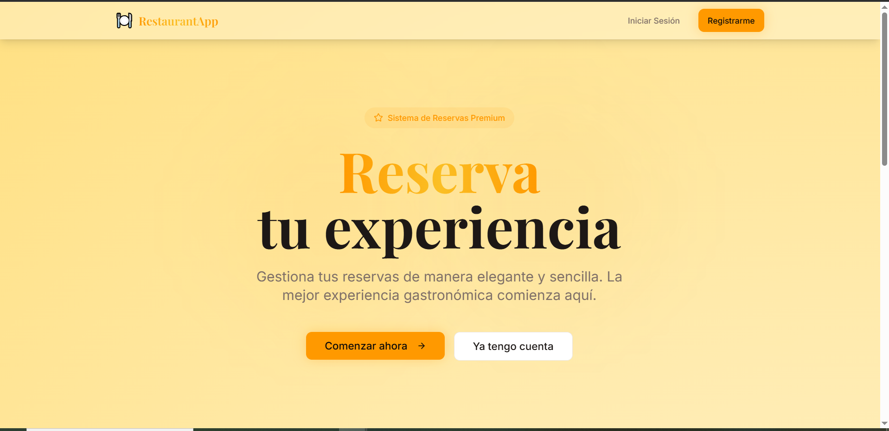
*Página principal con información del restaurante y acceso rápido a reservas*

---

### 🔐 Sistema de Autenticación
<table>
  <tr>
    <td width="50%">
      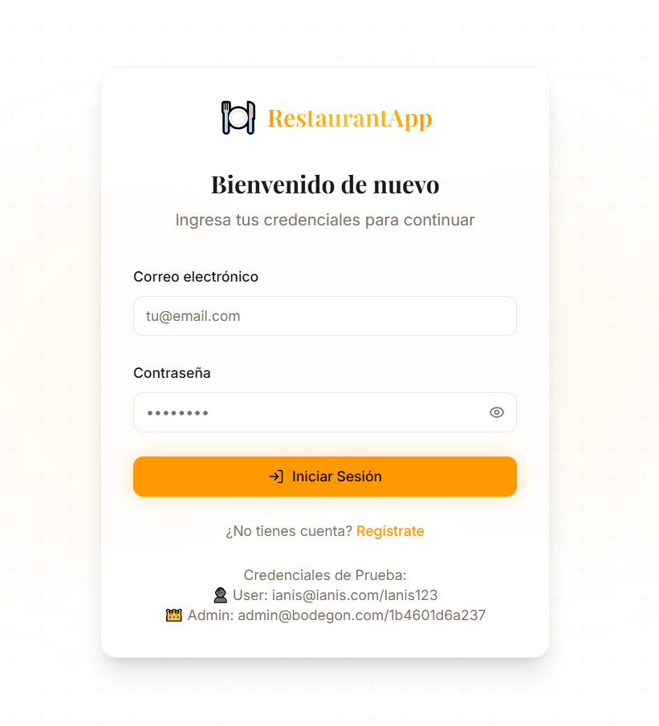
      <p align="center"><strong>Login</strong></p>
    </td>
    <td width="50%">
      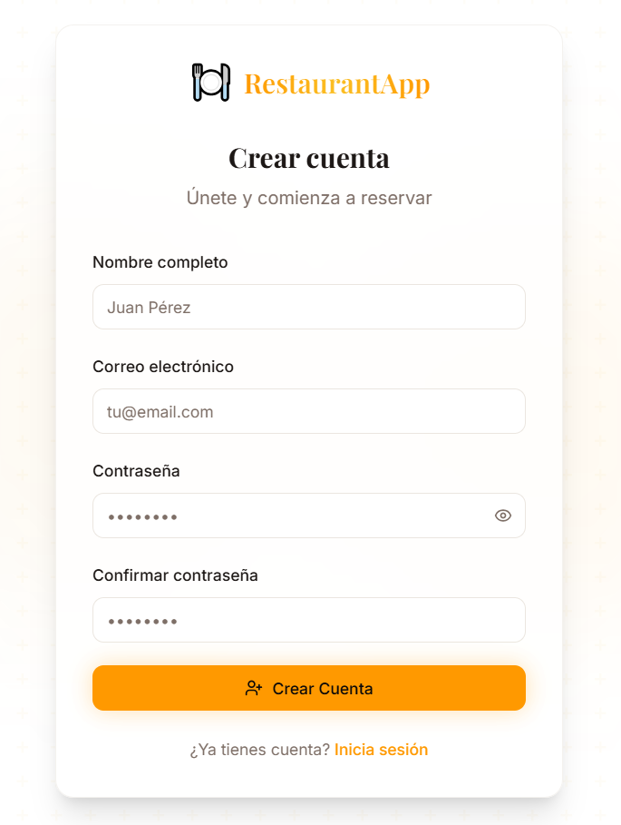
      <p align="center"><strong>Registro</strong></p>
    </td>
  </tr>
</table>

---

### 📅 Gestión de Reservas (Usuario)
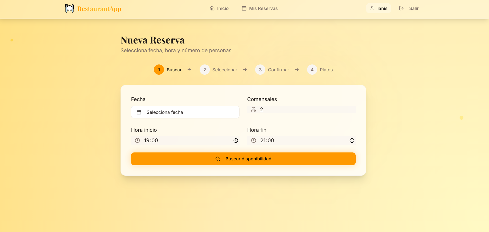
*Interfaz intuitiva para crear reservas con selección de fecha, hora, mesa y platos*

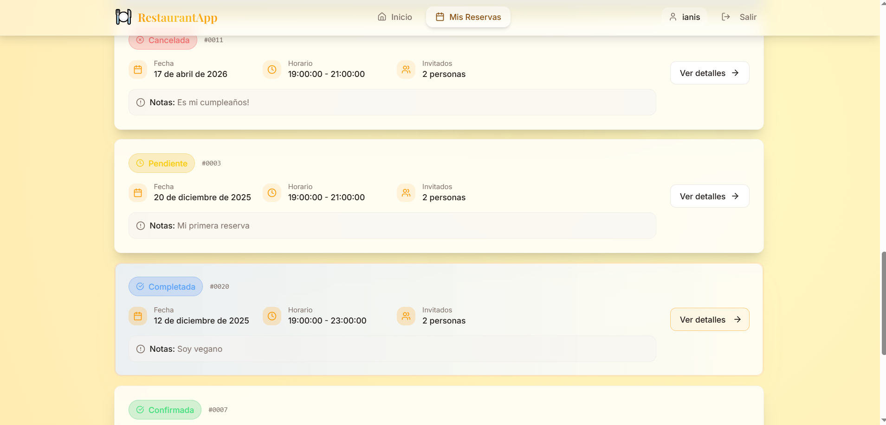
*Vista de todas tus reservas con opciones para editar o cancelar*

---

### 👨‍💼 Panel de Administración

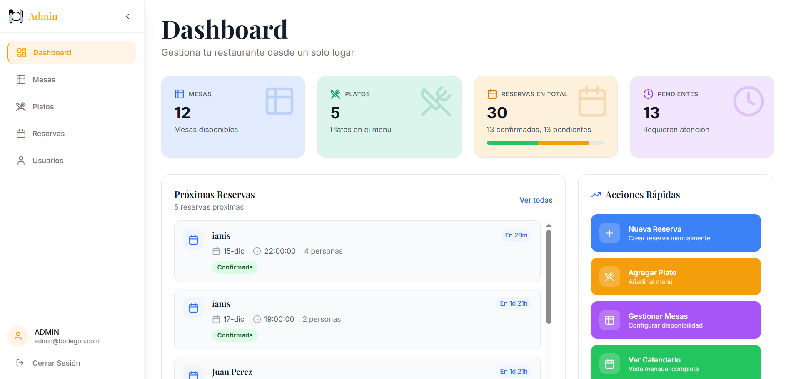
*Dashboard con estadísticas en tiempo real y gráficos interactivos*

<table>
  <tr>
    <td width="50%">
      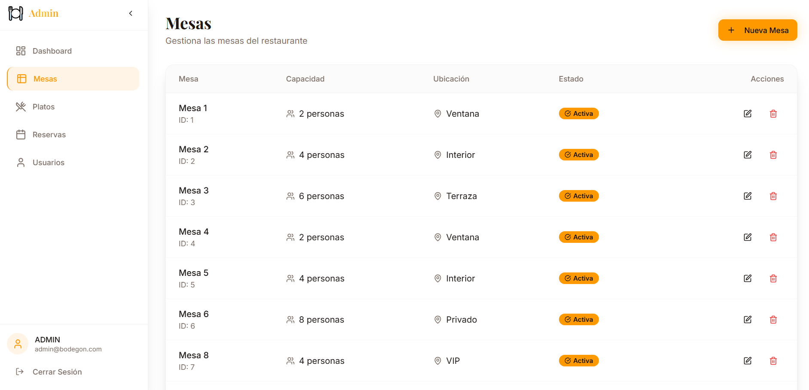
      <p align="center"><strong>Gestión de Mesas</strong></p>
    </td>
    <td width="50%">
      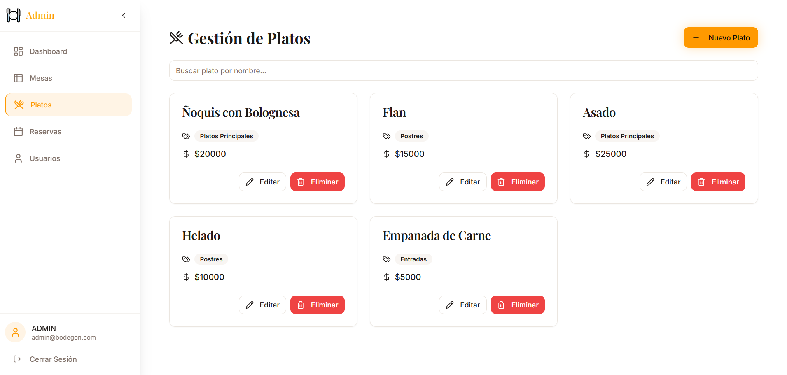
      <p align="center"><strong>Gestión de Platos</strong></p>
    </td>
  </tr>
</table>

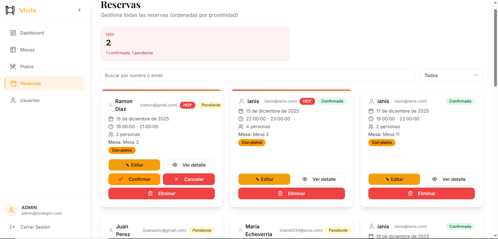
*Vista completa de todas las reservas del restaurante*

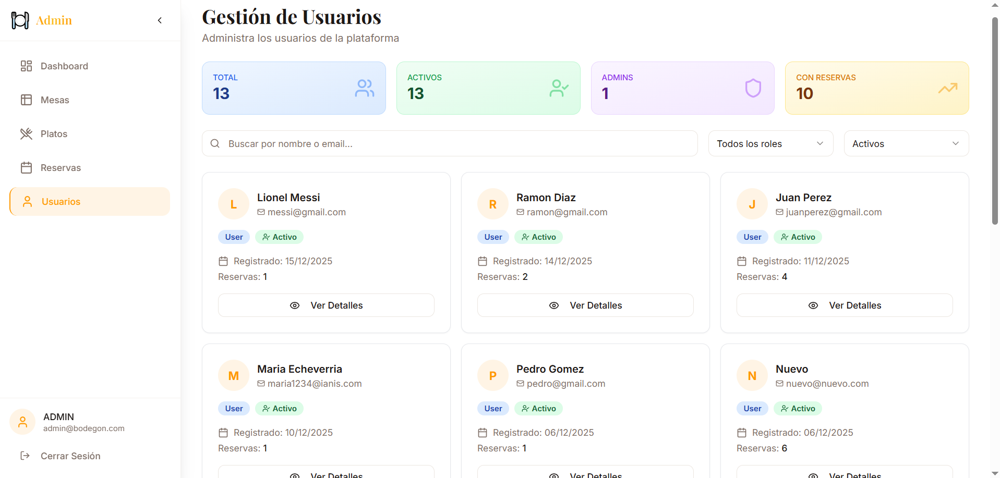
*Gestión de usuarios y roles*

---

### 📱 Diseño Responsivo
<table>
  <tr>
    <td width="33%">
      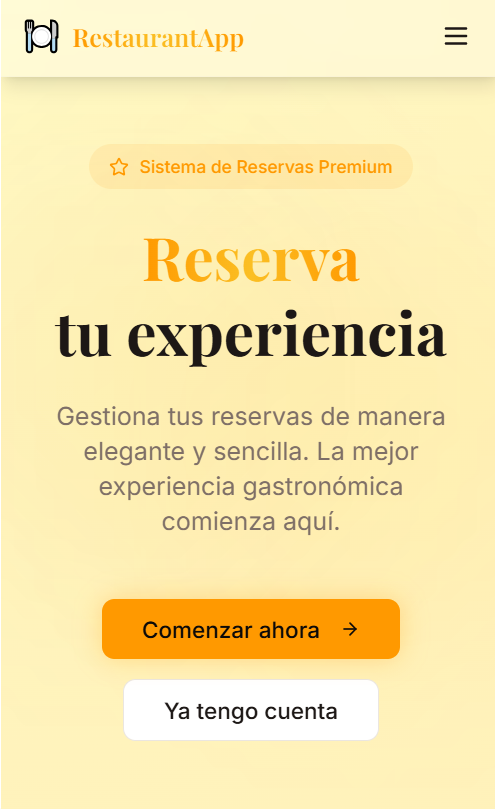
      <p align="center"><strong>Home Mobile</strong></p>
    </td>
    <td width="33%">
      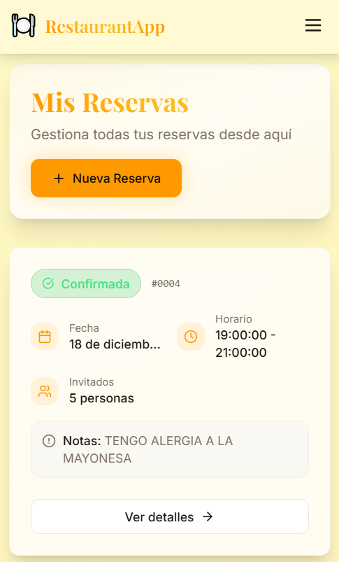
      <p align="center"><strong>Reservas Mobile</strong></p>
    </td>
    <td width="33%">
      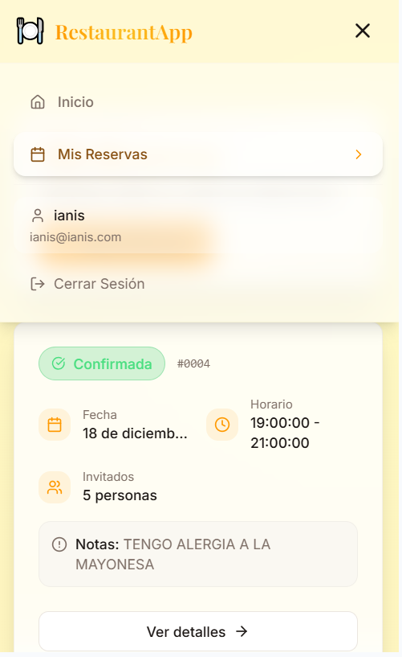
      <p align="center"><strong>Menú Mobile</strong></p>
    </td>
  </tr>
</table>

</div>

---

## 📋 Tabla de Contenidos

- [Descripción](#-descripción)
- [Características](#-características)
- [Stack Tecnológico](#-stack-tecnológico)
- [Requisitos Previos](#-requisitos-previos)
- [Instalación](#-instalación)
- [Configuración](#-configuración)
- [Uso](#-uso)
- [Arquitectura](#-arquitectura)
- [API Documentation](#-api-documentation)
- [Scripts Disponibles](#-scripts-disponibles)
- [Estructura del Proyecto](#-estructura-del-proyecto)
- [Contribución](#-contribución)
- [Licencia](#-licencia)

---

## 🎯 Descripción

**RestaurantApp** es una aplicación web full-stack moderna diseñada para gestionar reservas de restaurantes de forma eficiente. Ofrece una interfaz intuitiva para clientes que desean hacer reservas y un potente panel de administración para gestionar mesas, platos, reservas y usuarios.

### ✨ Características Principales

#### 👥 Para Clientes
- 🔐 **Autenticación Segura** - Sistema de registro y login con JWT
- 📅 **Reservas Inteligentes** - Selección de fecha, hora y mesa en tiempo real
- 🍽️ **Selección de Platos** - Añade platos a tu reserva
- 📱 **Interfaz Responsiva** - Diseño adaptado a todos los dispositivos
- 🔔 **Gestión de Reservas** - Visualiza, edita y cancela tus reservas

#### 👨‍💼 Para Administradores
- 📊 **Dashboard Completo** - Estadísticas y métricas en tiempo real
- 🪑 **Gestión de Mesas** - CRUD completo de mesas con capacidad y estados
- 🍕 **Gestión de Platos** - Administra el menú del restaurante
- 📋 **Gestión de Reservas** - Vista completa de todas las reservas
- 👤 **Gestión de Usuarios** - Control de usuarios y roles
- 📈 **Reportes Visuales** - Gráficos y estadísticas con Recharts

---

## 🛠️ Stack Tecnológico

### Backend
- **Framework**: .NET 9.0
- **ORM**: Entity Framework Core 9.0
- **Base de Datos**: PostgreSQL
- **Autenticación**: JWT (HS512)
- **Logging**: Serilog
- **Documentación**: Swagger/OpenAPI
- **Seguridad**: BCrypt.Net para hash de contraseñas

### Frontend
- **Framework**: React 18.3.1 + TypeScript 5.8.3
- **Build Tool**: Vite 5.4.19
- **Routing**: React Router DOM 6.30.1
- **State Management**: Zustand 5.0.9
- **Data Fetching**: TanStack Query 5.83.0
- **UI Components**: Radix UI + shadcn/ui
- **Styling**: Tailwind CSS 3.4.17
- **Animaciones**: Framer Motion 12.23.25
- **Forms**: React Hook Form 7.61.1 + Zod 3.25.76
- **Charts**: Recharts 2.15.4
- **HTTP Client**: Axios 1.13.2

### Herramientas de Desarrollo
- **Linting**: ESLint 9.32.0
- **Code Style**: TypeScript ESLint
- **AutoMapper**: Para mapeo de DTOs
- **Hot Reload**: Vite HMR + .NET Watch

---

## 📦 Requisitos Previos

Antes de comenzar, asegúrate de tener instalado:

- **Node.js** >= 18.x
- **.NET SDK** 9.0
- **PostgreSQL** >= 14.x
- **Git**

---

## 🚀 Instalación

### 1️⃣ Clonar el Repositorio

```bash
git clone https://github.com/tu-usuario/restaurantapp.git
cd restaurantapp
```

### 2️⃣ Configurar Backend

```bash
cd backend/Api

# Restaurar dependencias
dotnet restore

# Aplicar migraciones (esto se hace automáticamente al ejecutar)
dotnet ef database update
```

### 3️⃣ Configurar Frontend

```bash
cd ../../frontend

# Instalar dependencias
npm install
```

---

## ⚙️ Configuración

### Variables de Entorno - Backend

Crea un archivo `appsettings.json` o `appsettings.Development.json` en `backend/Api/`:

```json
{
  "ConnectionStrings": {
    "DefaultConnection": "Host=localhost;Port=5432;Database=restaurantdb;Username=tu_usuario;Password=tu_password"
  },
  "JWT_SECRET": "tu_clave_secreta_minimo_64_caracteres_para_HS512_seguridad_maxima",
  "JWT_ISSUER": "restaurantApp",
  "JWT_AUDIENCE": "restaurantApp_client",
  "Logging": {
    "LogLevel": {
      "Default": "Information",
      "Microsoft.AspNetCore": "Warning"
    }
  }
}
```

**Alternativamente**, puedes usar variables de entorno:

```bash
# Windows (PowerShell)
$env:ConnectionStrings__DefaultConnection="Host=localhost;..."
$env:JWT_SECRET="tu_clave_secreta..."

# Linux/Mac
export ConnectionStrings__DefaultConnection="Host=localhost;..."
export JWT_SECRET="tu_clave_secreta..."
```

### Variables de Entorno - Frontend

Crea un archivo `.env` en la carpeta `frontend/`:

```env
VITE_API_URL=http://localhost:5000
```

### 🔐 Usuario Administrador por Defecto

El sistema crea automáticamente un usuario administrador al iniciar:

```
Email: admin@restaurant.com
Password: Admin123!
```

> ⚠️ **IMPORTANTE**: Cambia estas credenciales en producción modificando `backend/Api/Data/Seeds/SeedData.cs`

---

## 🎮 Uso

### Ejecutar Backend

```bash
cd backend/Api
dotnet run
```

El backend estará disponible en:
- API: `http://localhost:5000`
- Swagger: `http://localhost:5000/swagger`
- Health Check: `http://localhost:5000/health`

### Ejecutar Frontend

```bash
cd frontend
npm run dev
```

El frontend estará disponible en: `http://localhost:8080`

### Ejecutar Todo el Stack

Opción 1 - Dos terminales:
```bash
# Terminal 1 (Backend)
cd backend/Api && dotnet run

# Terminal 2 (Frontend)
cd frontend && npm run dev
```

---

## 🏗️ Arquitectura

### Backend - Clean Architecture

```
backend/Api/
├── Controllers/         # Endpoints REST
├── Services/           # Lógica de negocio
│   ├── Interfaces/
│   └── Implementations/
├── Repositories/       # Acceso a datos
│   ├── Interfaces/
│   └── Implementations/
├── Models/            # Entidades y Enums
│   ├── Entities/
│   └── Enums/
├── DTOs/              # Data Transfer Objects
├── Data/              # DbContext y Seeds
│   └── Seeds/
├── Migrations/        # Migraciones EF Core
└── Utilities/         # Helpers y extensiones
```

### Frontend - Feature-Based Architecture

```
frontend/src/
├── components/        # Componentes reutilizables
│   ├── auth/         # Autenticación
│   ├── dashboard/    # Dashboard
│   └── ui/           # UI Components (shadcn)
├── pages/            # Páginas/Vistas
│   ├── admin/        # Panel administrador
│   ├── auth/         # Login/Register
│   └── reservations/ # Gestión de reservas
├── layouts/          # Layouts (Admin, User)
├── stores/           # Zustand stores
├── services/         # API services
├── hooks/            # Custom React hooks
├── lib/              # Utilidades
├── config/           # Configuración
└── enums/            # Enumeraciones
```

### Flujo de Datos

```
┌─────────────┐      HTTP/REST      ┌─────────────┐
│   React     │ ◄─────────────────► │   .NET API  │
│  Frontend   │      JWT Auth       │   Backend   │
└─────────────┘                     └─────────────┘
      │                                     │
      │ Zustand                             │ EF Core
      │ TanStack Query                      │
      ▼                                     ▼
  Local State                        ┌─────────────┐
  + Cache                            │ PostgreSQL  │
                                     │  Database   │
                                     └─────────────┘
```

---

## 📚 API Documentation

### Autenticación

#### POST `/api/auth/register`
Registra un nuevo usuario

**Body:**
```json
{
  "name": "Juan Pérez",
  "email": "juan@example.com",
  "password": "Password123!",
  "phoneNumber": "+54 9 11 1234-5678"
}
```

#### POST `/api/auth/login`
Inicia sesión

**Body:**
```json
{
  "email": "juan@example.com",
  "password": "Password123!"
}
```

**Response:**
```json
{
  "token": "eyJhbGciOiJIUzUxMiIs...",
  "user": {
    "id": 1,
    "name": "Juan Pérez",
    "email": "juan@example.com",
    "role": "User"
  }
}
```

### Reservas

#### GET `/api/reservations`
Lista todas las reservas del usuario autenticado

#### POST `/api/reservations`
Crea una nueva reserva

**Body:**
```json
{
  "tableId": 1,
  "reservationDate": "2024-12-20T20:00:00Z",
  "numberOfGuests": 4,
  "dishIds": [1, 2, 3]
}
```

#### GET `/api/reservations/{id}`
Obtiene detalles de una reserva

#### PUT `/api/reservations/{id}`
Actualiza una reserva

#### DELETE `/api/reservations/{id}`
Cancela una reserva

### Mesas (Admin)

#### GET `/api/tables`
Lista todas las mesas

#### POST `/api/tables`
Crea una nueva mesa

#### PUT `/api/tables/{id}`
Actualiza una mesa

#### DELETE `/api/tables/{id}`
Elimina una mesa

### Platos (Admin)

#### GET `/api/dishes`
Lista todos los platos

#### POST `/api/dishes`
Crea un nuevo plato

#### PUT `/api/dishes/{id}`
Actualiza un plato

#### DELETE `/api/dishes/{id}`
Elimina un plato

> 📖 **Documentación completa**: Visita `http://localhost:5000/swagger` cuando el backend esté corriendo

---

## 📜 Scripts Disponibles

### Backend

```bash
# Ejecutar en modo desarrollo
dotnet run

# Ejecutar con watch (hot reload)
dotnet watch run

# Crear migración
dotnet ef migrations add NombreMigracion

# Aplicar migraciones
dotnet ef database update

# Revertir última migración
dotnet ef migrations remove

# Compilar
dotnet build

# Publicar para producción
dotnet publish -c Release
```

### Frontend

```bash
# Desarrollo
npm run dev

# Build producción
npm run build

# Preview build
npm run preview

# Lint
npm run lint

# Build desarrollo
npm run build:dev
```

---

## 📁 Estructura del Proyecto

<details>
<summary>🔽 Ver estructura completa</summary>

```
RestaurantApp/
├── backend/
│   └── Api/
│       ├── Controllers/
│       ├── Services/
│       ├── Repositories/
│       ├── Models/
│       ├── DTOs/
│       ├── Data/
│       ├── Migrations/
│       ├── Utilities/
│       ├── Properties/
│       ├── logs/
│       ├── Program.cs
│       ├── Api.csproj
│       └── appsettings.json
│
├── frontend/
│   ├── src/
│   │   ├── components/
│   │   ├── pages/
│   │   ├── layouts/
│   │   ├── stores/
│   │   ├── services/
│   │   ├── hooks/
│   │   ├── lib/
│   │   ├── config/
│   │   ├── enums/
│   │   ├── App.tsx
│   │   └── main.tsx
│   ├── public/
│   ├── package.json
│   ├── vite.config.ts
│   ├── tailwind.config.js
│   └── tsconfig.json
│
├── .github/
│   └── workflows/
└── README.md
```

</details>

---

## 🔒 Seguridad

- ✅ Autenticación JWT con HMAC-SHA512
- ✅ Contraseñas hasheadas con BCrypt
- ✅ Validación de entrada en frontend y backend
- ✅ CORS configurado para origen específico
- ✅ Tokens con expiración configurable
- ✅ Roles de usuario (User, Admin)
- ✅ Rutas protegidas por autenticación y autorización

---

## 🧪 Testing

```bash
# Backend
cd backend/Api
dotnet test

# Frontend
cd frontend
npm run test
```

---

## 🚢 Deployment

### Backend (Azure/AWS/Railway)

1. Configurar variables de entorno en el servidor
2. Aplicar migraciones: `dotnet ef database update`
3. Publicar: `dotnet publish -c Release`
4. Ejecutar con servidor reverse proxy (Nginx/IIS)

### Frontend (Vercel/Netlify)

```bash
npm run build
```

Configurar variable de entorno `VITE_API_URL` con la URL de producción del backend.

---

## 🤝 Contribución

Las contribuciones son bienvenidas! Por favor:

1. Fork el proyecto
2. Crea una rama para tu feature (`git checkout -b feature/AmazingFeature`)
3. Commit tus cambios (`git commit -m 'Add some AmazingFeature'`)
4. Push a la rama (`git push origin feature/AmazingFeature`)
5. Abre un Pull Request

---

## 📄 Licencia

Este proyecto está bajo la Licencia MIT. Ver archivo `LICENSE` para más detalles.

---

## 👨‍💻 Autor

**Ianis A. Manos Vignolo**

- GitHub: [@ianismv](https://github.com/ianismv)
- LinkedIn: [Ianis Manos Vignolo](www.linkedin.com/in/ianismv)
- Email: manosianis@gmail.com

En colaboración con: 

Axel Leguero [@AxelOP96](https://github.com/AxelOP96)
Sabrina Montiel : Sabri070897@gmail.com

---

## 🙏 Agradecimientos

- [shadcn/ui](https://ui.shadcn.com/) - Componentes UI
- [Radix UI](https://www.radix-ui.com/) - Primitivos accesibles
- [Tailwind CSS](https://tailwindcss.com/) - Framework CSS
- [.NET](https://dotnet.microsoft.com/) - Framework backend
- [React](https://react.dev/) - Librería frontend

---

<div align="center">

⭐ Si este proyecto te fue útil, considera darle una estrella en GitHub ⭐

**Hecho con ❤️ y mucho 🧉**

</div>